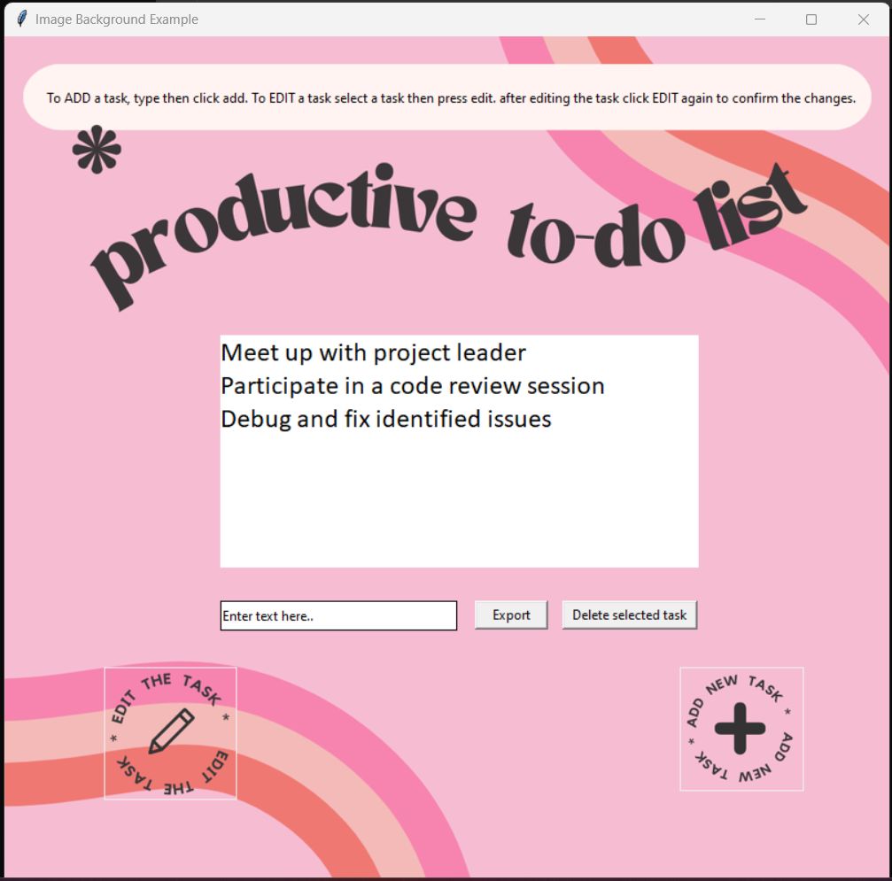

Task Management App
A Python project with a nice simple UI that lists the user's tasks. It provides the ability to add, edit, delete and export tasks to a text file.

App UI

Requirements:
Requires installing Pillow.
type in cmd:
pip install pillow
